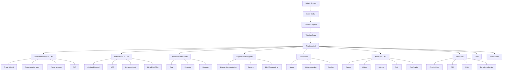

# CAR para Todos - PWA Product Design and Functional Analysis

## 1. Visão do produto
CAR para Todos é uma Progressive Web App voltada para produtores rurais, técnicos, cooperativas e analistas ambientais. O objetivo é simplificar o entendimento do Cadastro Ambiental Rural, oferecer orientação legal em linguagem acessível, apoiar diagnósticos, conectar usuários a benefícios e facilitar o acesso a apoio técnico.

A experiência deve transmitir:
- simplicidade
- confiança institucional
- sustentabilidade
- segurança
- inclusão
- tecnologia acessível

A aplicação deve funcionar como um produto digital de alto impacto social, com experiência semelhante a um app nativo, priorizando o uso em celulares.

---

## 2. Objetivos de negócio
- reduzir barreiras de acesso à informação ambiental e regulatória
- orientar produtores rurais com linguagem simples e objetiva
- facilitar a compreensão do CAR, das leis e dos deveres
- conectar usuários a benefícios, apoio técnico e serviços públicos
- oferecer diagnósticos inteligentes e recomendações acionáveis
- criar uma plataforma confiável para uso em larga escala pelo Governo Federal

---

## 3. Público-alvo
### Produtor rural
- busca orientação prática e objetiva
- precisa de linguagem simples
- valoriza recursos offline e acesso rápido

### Técnico / cooperativa
- precisa de conteúdo técnico e materiais de apoio
- usa a plataforma para orientar produtores

### Analista ambiental
- precisa de relatórios, diagnósticos e rastreio de pendências
- valoriza dados e organização operacional

---

## 4. Princípios de experiência
- interface simples e direta
- linguagem acessível
- navegação intuitiva
- alto contraste e acessibilidade
- foco em celular
- design institucional e moderno
- offline-first em conteúdos-chave
- respostas rápidas e ação imediata

---

## 5. Arquitetura funcional da PWA

### Camadas da aplicação
1. Camada de apresentação
- telas responsivas para celular, tablet e desktop
- navegação por bottom navigation e menu superior
- instalação como app no dispositivo
- splash screen personalizada
- manifest completo

2. Camada de experiência do usuário
- onboarding guiado
- tela inicial com cartões de ação
- assistente inteligente com histórico e sugestões
- diagnóstico em etapas
- conteúdos educativos em formatos curtos

3. Camada de conteúdo
- conteúdos sobre CAR, leis, benefícios, apoio local, glossário e estudos de caso
- conteúdos organizados por categorias e módulos

4. Camada de dados e inteligência
- motor de diagnóstico
- recomendações personalizadas
- histórico do usuário
- favoritos e buscas inteligentes

5. Camada de suporte e governança
- notificações
- logs de uso
- painel administrativo
- segurança e auditoria

### Requisitos PWA
- instalação no celular
- splash screen personalizada
- ícone na tela inicial
- funcionamento offline para conteúdos baixados
- cache inteligente
- atualização automática
- experiência semelhante a app nativo
- modo retrato e paisagem
- carregamento rápido

---

## 6. Jornada completa do usuário

### Jornada 1 - Novo usuário
1. abertura do app
2. splash screen
3. boas-vindas
4. escolha de perfil
5. tutorial rápido
6. tela principal
7. acesso ao conteúdo inicial

### Jornada 2 - Usuário quer entender o CAR
1. entra na tela inicial
2. acessa “Quero entender meu CAR”
3. navega por explicações, vídeos e FAQ
4. salva conteúdo como favorito
5. compartilha informação com terceiros

### Jornada 3 - Usuário precisa de diagnóstico
1. abre o diagnóstico
2. responde perguntas em etapas
3. visualiza situação, risco, pendências e recomendações
4. baixa ou compartilha relatório
5. agenda próximo passo

### Jornada 4 - Usuário precisa de apoio técnico
1. abre “Apoio Local”
2. busca por estado, município ou tipo de serviço
3. vê pontos de apoio no mapa
4. visualiza telefone, WhatsApp e rota

### Jornada 5 - Usuário quer aprender mais
1. entra na Academia CAR
2. acessa cursos, artigos, vídeos e quizzes
3. acompanha progresso e conquistas
4. recebe certificado

### Jornada 6 - Usuário retorna ao app
1. entra no app com conexão limitada
2. acessa conteúdos baixados offline
3. consulta notificações salvas
4. sincroniza quando voltar a internet

---

## 7. Fluxograma de navegação



---

## 8. Wireframes por tela

### 8.1 Splash Screen
- fundo institucional com logo e ícone
- animação leve de entrada
- progress bar ou efeito de carregamento
- mensagem curta de abertura

### 8.2 Tela de boas-vindas
- hero visual com imagem temática rural e ambiental
- texto curto de acolhimento
- botão principal “Começar”
- botão secundário “Entrar mais tarde”

### 8.3 Escolha de perfil
- cards verticais ou em grid
- opções: Produtor Rural, Técnico/Cooperativa, Analista Ambiental
- cada card com ícone, título e descrição curta
- botão continuar

### 8.4 Tutorial rápido
- 3 passos curtos com imagens ou ilustrações
- progresso visual
- botão “Pular”

### 8.5 Tela principal
- header fixo com logo, pesquisa, notificação e perfil
- cards grandes e ilustrados
- bottom navigation com 5 opções principais
- destaque para conteúdo mais relevante

### 8.6 Tela “Quero entender meu CAR”
- hero com explicação do tema
- cards por assunto: o que é, quem precisa, como funciona, benefícios
- linha do tempo visual
- vídeos e infográficos em cards
- seção FAQ

### 8.7 Tela “Entendendo as Leis”
- cards por tema legal
- cada cartão com ícone, título, resumo e botão “Saiba mais”
- escrita simples com exemplos práticos
- seção de mitos e verdades
- glossário acessível

### 8.8 Assistente Inteligente
- layout tipo chat
- histórico lateral ou superior
- sugestões iniciais
- painel de conversa com bolhas de mensagem
- opção de áudio, voz e compartilhamento
- botão de microfone

### 8.9 Diagnóstico Inteligente
- formulário em etapas com indicador de progresso
- perguntas curtas e objetivas
- cada etapa com um único foco
- tela final com resumo visual
- seções: situação, risco, pendências, recomendações, plano de ação
- botões: salvar, baixar PDF, compartilhar, imprimir

### 8.10 Apoio Local
- mapa interativo central
- filtro por estado e município
- cards de instituições abaixo do mapa
- botão para ver telefone, WhatsApp e rota
- contato direto e marcação no mapa

### 8.11 Academia CAR
- destaque para cursos em andamento
- blocos por categoria: cursos, vídeos, artigos, quiz
- cards com progresso visual
- ranking e conquistas
- certificados listados

### 8.12 Benefícios
- cards por programa: Crédito Rural, PSA, PRA, benefícios fiscais
- filtros por estado, município e tipo de benefício
- páginas de detalhe com requisitos e contato

### 8.13 Perfil
- foto, nome, progresso geral
- cards de diagnósticos, cursos, certificados
- configurações de idioma, tema, acessibilidade

### 8.14 Notificações
- lista de lembretes, novidades e alertas
- agrupamento por categoria
- ações rápidas: ver detalhes, marcar lido, revisar conteúdo

---

## 9. Design System

### Cores
- Azul institucional: #0F4C81
- Azul médio: #1E6FB8
- Azul claro: #4F8CFF
- Azul suave: #6DC7FF
- Verde sucesso: #25C26E
- Amarelo alerta: #F2B84B
- Vermelho erro: #E45757
- Cinza escuro: #11233B
- Cinza médio: #6C7A8A
- Cinza claro: #F5F8FC
- Branco: #FFFFFF

### Tipografia
- Família: Inter, Segoe UI, Roboto, Arial, sans-serif
- Hierarquia visual clara e acessível
- títulos em peso forte
- corpo legível com alto contraste

### Componentes visuais
- cards arredondados
- sombras suaves
- muito espaço em branco
- ícones outline
- micro animações leves
- layouts limpos e focados em ação

### Botões
- primário: azul institucional
- secundário: branco com borda azul
- sucesso: verde
- perigo: vermelho
- hover, focus e disabled com estados claros

### Inputs
- bordas arredondadas
- foco azul visível
- validação com feedback claro

### Cards
- fundo branco
- raio de borda elevado
- sombra sutil
- espaço interno generoso

### Sidebar
- fundo azul escuro
- navegação clara por grupos
- destaque para item ativo

### Bottom Navigation
- ícones simples e consistentes
- 5 itens principais
- estado ativo com cor principal

### Modais
- overlay escuro
- corpo central alinhado
- ações simples e objetivas

### Badges e alertas
- verde para sucesso
- amarelo para aviso
- vermelho para erro
- azul para informação

### Ícones
- Bootstrap Icons ou biblioteca de ícones outline consistente

### Animações
- transições curtas e suaves
- feedback visual em toque e clique
- carregamento leve e elegante

---

## 10. Organização dos componentes

### Componentes de interface
- App shell
- Header fixo
- Bottom navigation
- Hero cards
- Content cards
- Stepper
- Chat card
- Map card
- Form fields
- Modal dialogs
- Empty states
- Loading states
- Toasts e alertas
- Profile header
- Progress bar
- Badge status

### Componentes de conteúdo
- cards explicativos
- cards de lei
- cards de benefício
- cards de curso
- cards de vídeo
- cards de artigo
- cards de apoio local

### Componentes de interação
- busca global
- filtros
- favoritos
- compartilhamento
- download PDF
- microfone e voz
- sincronização offline

---

## 11. Funcionalidades principais
- onboarding inicial
- escolha de perfil
- tela principal com cartões
- compreensão do CAR
- explicações das leis ambientais
- assistente inteligente
- diagnóstico inteligente em etapas
- apoio local com mapa
- academia CAR com aprendizagem gamificada
- benefícios e programas
- perfil personalizado
- notificações inteligentes
- acessibilidade completa
- modo offline
- sincronização automática
- busca inteligente
- favoritos e histórico
- compartilhamento e exportação de arquivos

---

## 12. Estrutura de pastas sugerida

```text
public/
  manifest.json
  service-worker.js
  icons/
  images/
  splash/

src/
  app/
    core/
      layout/
      routes/
      services/
      store/
      utils/
    features/
      onboarding/
      home/
      car-understanding/
      laws/
      assistant/
      diagnosis/
      support-map/
      academy/
      benefits/
      profile/
      notifications/
      offline/
      accessibility/
    shared/
      components/
      ui/
      icons/
      styles/
      hooks/

resources/
  data/
  content/
  translations/

server/
  api/
  auth/
  sync/
  admin/
```

---

## 13. Estratégia PWA

### Instalação
- botão “Instalar app” na tela inicial
- prompt nativo quando apropriado
- instalação sem depender de loja

### Offline
- conteúdo estático e conteúdos baixados ficam disponíveis
- diagnósticos salvos e certificados acessíveis offline
- sincronização automática ao voltar a conexão

### Cache inteligente
- cache de conteúdo público
- cache de telas principais
- atualização incremental
- validação de versão

### Performance
- carregamento rápido
- imagens otimizadas
- navegação leve e responsiva
- uso de componentes reutilizáveis

---

## 14. Requisitos de acessibilidade
- alto contraste
- modo escuro
- aumento de fonte
- leitor de tela
- comandos por voz
- VLibras
- leitura em voz
- linguagem simples
- botões grandes
- ícones intuitivos
- navegação por teclado
- contraste adequado em todos os componentes

---

## 15. Roadmap de desenvolvimento

### Fase 1 - MVP Hackathon 48 horas
- splash screen
- onboarding
- tela principal
- tela “Quero entender meu CAR”
- tela “Entendendo as Leis”
- assistente inteligente básico
- diagnóstico em etapas básico
- apoio local com mapa simples
- academia CAR com cards básicos
- perfil básico
- notificações básicas
- design system base

### Fase 2 - Validação e refinamento
- integração com conteúdo real
- melhorias de acessibilidade
- offline mais robusto
- sincronização automática
- busca global
- favoritos e histórico

### Fase 3 - Escala e publicação
- painel administrativo
- integração com APIs governamentais
- relatórios exportáveis
- conexão com suporte técnico e órgãos parceiros
- publicação no portal GOV.BR e via PWA installable

---

## 16. MVP para hackathon em 48 horas

### Escopo prioritário
1. Splash screen e onboarding
2. Tela principal com cartões principais
3. Tela de entendimento do CAR
4. Tela de leis simplificadas
5. Assistente inteligente com chat estático e sugestões
6. Diagnóstico em etapas com resumo final
7. Mapa de apoio local simples
8. Academia CAR com cursos e artigos básicos
9. Perfil simples
10. Notificações básicas
11. Design system base
12. Configuração PWA mínima

### Critérios de sucesso do MVP
- experiência visual moderna e profissional
- navegação simples e intuitiva
- conteúdo claro e acessível
- uso fluido em celular
- aparência de produto pronto para publicação
- demonstração forte de impacto social

---

## 17. Critérios de qualidade para lançamento
- aparência institucional e confiável
- navegação intuitiva
- conteúdo simplificado e útil
- acessibilidade completa
- experiência offline funcional
- carregamento rápido
- instalação como app
- atualização automática
- segurança e rastreabilidade

---

## 18. Conclusão
CAR para Todos deve ser percebido como uma plataforma pública digital moderna, acessível, útil e confiável. A proposta combina tecnologia, educação ambiental, orientação jurídica simplificada e apoio técnico em uma única experiência, com foco principal em celular e com forte potencial de impacto social e governamental.
